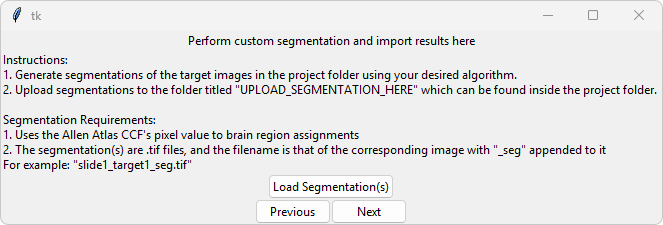
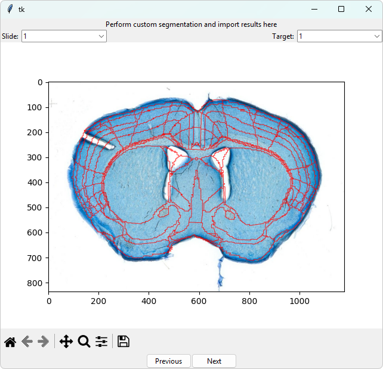

# Segmentation Guide

Users have two options for segmenting their sample images:
- [In-Built Segmentation](#dart-in-duilt-segmentation-algorithm)
- [Custom Segmentation](#upload-custom-segmentation)

## `DART` In-Built Segmentation Algorithm

After completing the Slide Processor Page, `DART` walks you through a semi-automatic registration to your chosen atlas. The two steps are shown here.

### Prepare for STalign

The Section Processor Page (**Figure 1**) serves three functions: estimation of an affine transformation to map the atlas to the target section, annotation of landmark points, and adjustment of STalign parameters. Use the bottom slider to approximate the section in your 3D atlas that best matches the section. Use the three sliders on the right to adjust the rotation angles of the atlas to more closely match the slice. This is your initial "guess" for the alignment, and even if it's not perfect, it will greatly speed up on converging on a proper alignment.

Next, add landmark points by clicking corresponding landmarks on the target section image and the atlas image, then clicking “Add Point” in the top panel. 

Finally, you can tune the parameters of STalign either at a high-level through the dropdown menu or in detail through the text entries. The slower transforms are generally more accurate. You can save these parameters by clicking **Save parameters for slice** in the bottom right. 

If you have multiple slices, you can navigate to the different slices using the **Target** panel on the top right, and initialize an alignment for each one. 

  
**Figure 1. Section Processor Page**

### Run STalign and View Results

In the STalign Runner Page (**Figures 2, 3, 4**), STalign is run on the section images when the “Run” button is clicked. Upon completion of STalign, the results are displayed by overlaying the calculated region boundaries over the section image (**Figure 7**). 

  
**Figure 2. STalign Runner Page**

  
**Figure 3. STalign Progress Monitor**

  
**Figure 4. STalign Results Display**

## Upload Custom Segmentation

To use a custom segmentation pipeline, first find the project folder that was created for this instance of `DART`. It will be inside the folder with all your slide images, with a name following the format `DART-[datetime]`. Inside that folder, you will find images of each slice cropped using the user-drawn boundaries from the previous page. Use these images to generate segmentations using your custom pipeline. Upload the segmentations to the folder titled "UPLOAD_SEGMENTATION_HERE" inside the project folder. The segmentations should follow these requirements:

1. The segmentations should use the Allen Atlas CCF pixel value to brain region assignments.
2. Each slice's segmentation should be saved as an individual `.tif`.
3. The filename of the segmentation should be the filename of the corresponding image with "_seg" appended to the end.

Then, in the Segmentation Importer page (**Figure 5**), click "Load Segmentation(s)". If the upload is succesful, a results window (**Figure 6**) will appear, displaying the boundaries of your segmentations overlaid on the original images.

  
**Figure 5. Segmentation Importer Page**

  
**Figure 6. Segmentation Importer Results Display**

